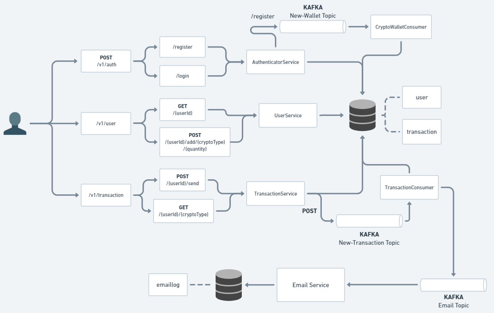

# 🪙 Virtual Crypto Wallet API

A virtual wallet to manage Bitcoin, Litecoin and Dogecoin,
having real addresses but fictitious transactions,
with no real value. Made for study purposes, but can be useful
for personal projects and learning

## 🚀 Technology Stack

- <b>Spring Boot 3.2.2 🌱</b>
- <b>MongoDB 🍃</b>
- <b>Docker 🐋</b>
- <b>Apache Kafka</b>
- <b>Golang</b>
- <b>PostgreSQL 🐘</b>
- <b>Testify 🧪</b>
- <b>SMTP ✉️</b>
- <b>Swagger 📜</b>

## 🛠️ Integration and Security

- <b>Spring Cloud OpenFeign:</b> employed to facilitate integration with third-party system.
- <b>JWT Token-Based Authentication:</b> is the foundational authorization mechanism of the application. Valid for one hour.
- <b>Spring Security:</b> ensure comprehensive protection of resources and endpoints.
- <b>SMTP:</b> employed to send transaction emails via gmail smtp server.

## 🗺️ Project Architecture



#### <b>Why Kafka ?</b>

Kafka was introduced to handle asynchronous processing,
imagining a real world scenario where transactions can take a time
to be completed, same for the register endpoint, where it uses a third party
API.

## 🚩 Getting Started

 <b>1</b> - Make sure to have installed

- Docker
- Maven

<b>2</b> - Clone the project

```bash
git clone https://github.com/BernardoDenkvitts/Virtual-Wallet-API-Project.git
```

Go to project root directory

```bash
cd /Virtual-Wallet-API-Project
```

<b>3</b> - Check https://www.blockcypher.com/ to generate your personal token. After it, goes to VirtualWalletAPI/src/main/resources/application.yaml and set your token to variable called token, it's necessary to use third-party service

```bash
token: your-token
```

<b>4</b> - Create your gmail smtp configurations and setup the .env files inside /EmailSenderService
<p>Useful links:
<p>https://mailtrap.io/blog/gmail-smtp/</p>
<p>https://youtu.be/JDA3a8tEBlo</p> 

```bash
emailhost=
emailport=
emailuser=
emailpassword=
```

<b>5</b> - Create the Application JAR 

```bash
  cd VirtualWalletAPI
```

```bash
mvn package install
```

<b>6</b> - Starting containers (Application, MongoDB, Zookeeper, Kafka, PostgreSQL, Golang Service)

```bash
docker-compose build
docker-compose up -d
```

## 📜 API Reference

* <b>Swagger URL : </b> http://localhost:8080/swagger-ui/index.html#/